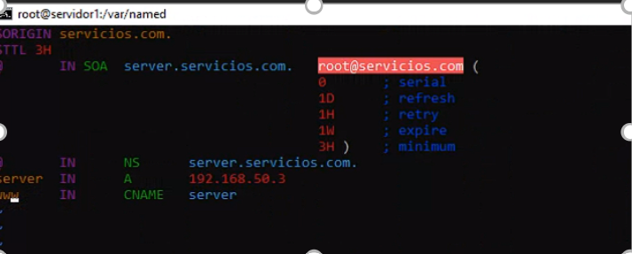

# HAproxy_cargas
## Installation
1. Primeros vamos a crear las maquinas, nos demoraremos 30 - 45 min en montar las maquinas.

# -- mode: ruby --
# vi: set ft=ruby :
Vagrant.configure("2") do |config|
 config.vm.define :servidor1 do |servidor1|
 servidor1.vm.box = "generic/centos8"
 servidor1.vm.network :private_network, ip: "192.168.50.2"
 servidor1.vm.hostname = "servidor1"
 end
 config.vm.define :servidor2 do |servidor2|
 servidor2.vm.box = "generic/centos8"
 servidor2.vm.network :private_network, ip: "192.168.50.3"
 servidor2.vm.hostname = "servidor2"
 end
 config.vm.define :haproxy do |haproxy|
 haproxy.vm.box = "generic/centos8"
 haproxy.vm.network :private_network, ip: "192.168.50.4"
 haproxy.vm.hostname = "haproxy"
 end
 config.vm.define :servidor3 do |servidor3|
 servidor3.vm.box = "generic/centos8"
 servidor3.vm.network :private_network, ip: "192.168.50.5"
 servidor3.vm.hostname = "servidor3"
 end
end

`vagrant up`

2. Despues iremos a el servidor haproxy

## Using project
`vagrant ssh haproxy`

3. En el haproxy descargaremos lo siguiente:

`Sudo yum install vim`
`Sudo yum install haproxy`

4. Despues iremos al archivo del haproxy que se encuentra en etc y lo vamos a modificar con vim

`cd /etc/haproxy/`
`vim haproxy.cfg`

5. Pondremos lo siguiente en el archivo

#configuracion global
global

    log         127.0.0.1 local2

    chroot      /var/lib/haproxy
    pidfile     /var/run/haproxy.pid
    maxconn     4000
    user        haproxy
    group       haproxy
    daemon

    # turn on stats unix socket
    stats socket /var/lib/haproxy/stats

    # utilize system-wide crypto-policies
    ssl-default-bind-ciphers PROFILE=SYSTEM
    ssl-default-server-ciphers PROFILE=SYSTEM

#---------------------------------------------------------------------
# common defaults that all the 'listen' and 'backend' sections will
# use if not designated in their block
#---------------------------------------------------------------------
defaults
    mode                    http
    log                     global
    option                  httplog
    option                  dontlognull
    option http-server-close
    option forwardfor       except 127.0.0.0/8
    option                  redispatch
    retries                 3
    timeout http-request    10s
    timeout queue           1m
    timeout connect         10s
    timeout client          1m
    timeout server          1m
    timeout http-keep-alive 10s
    timeout check           10s
    maxconn                 3000

frontend  stats
        bind 192.168.50.5:5000
        mode            http
        log             global

        maxconn 10

       clitimeout      100s
        srvtimeout      100s
        contimeout      100s
        timeout queue   100s

        stats enable
        stats hide-version
        stats refresh 30s
        stats show-node
        stats auth admin:password
        stats uri  /haproxy?stats

#---------------------------------------------------------------------
# main frontend which proxys to the backends
#---------------------------------------------------------------------
frontend main
    bind *:80
   # acl url_static       path_beg       -i /static /images /javascript /stylesheets
    #acl url_static       path_end       -i .jpg .gif .png .css .js

    #use_backend static          if url_static
    default_backend             app

#---------------------------------------------------------------------
# static backend for serving up images, stylesheets and such
#---------------------------------------------------------------------
backend static
    balance     roundrobin
    server      static 127.0.0.1:4331 check

#---------------------------------------------------------------------
# round robin balancing between the various backends
#---------------------------------------------------------------------
backend app
    balance     roundrobin
    server  app1 192.168.50.3:80 check
    server  app2 192.168.50.4:80 check

6. Guardamos
    `wq!`

6. Corremos
    `service haproxy start/restart`

7. Vamos al servidor1 e instalamos los siguientes comandos
    `Sudo yum install vim  `
    `Sudo yum install httpd`
    `yum install bind-utils bind-libs bind-* `
    `yum install net-tools `
8. Desactivamos(Disabled) SELINUX y paramos Firewalld
    `Vim /etc/selinux/config `
    `Service firewalld stop `
8. Vamos a configurar el archivo named.conf, los puertos y la ip
    `vim /etc/named.conf`
    

9. En el mismo archivo agregamos la zona hacia adelante y la zona detras

10. Ahora configuramos la zona hacia delante y detras en var/named
    `cd var/named`

11. Configuramos las dos zonas con vim 

12. Creamos un index.html 
    `cd /var/www/html`
    `vim index.html`
    En el archivo utilizamos una cadena de texto "Hola servidor 1"
    
13. Reiniciamos todos los servicios necesarios(named, httpd)

14. HACEMOS LO MISMO HECHO EN EL SERVIDOR 1 EN EL SERVIDOR 2 Y 3

15. Descaramos Artillery, ellos tienen un tutorial: https://www.artillery.io/docs/guides/getting-started/writing-your-first-test

16. En un navegador pondremos las estadisticas del haproxy: 192.168.50.5:5000/haproxy?stats
17. la auth es:
    `admin`
    `passwd`
17. creamos en visual studio un archivo: prueba.yml y el siguiente codigo adentro:
    config:
  http:
    extendedMetrics: true
  target: "https://example.com/api"
  phases:
    - duration: 15
      arrivalRate: 5
      rampTo: 15
      name: Initial ramp-up
    - duration: 15
      arrivalRate: 15
      rampTo: 30
      name: Intermediate ramp-up
    - duration: 15
      arrivalRate: 30
      rampTo: 60
      name: Peak load
scenarios:
  - flow:
      - get:
          url: "/"
18. corremos este codigo en jormato json desde el windows powershell con el comando
    `artillery run prueba.yml`

19. Disfruta! los informes artillery y las peticiones del punto 16 y 17 depende de que tipo de pruebas quieras hacer.
